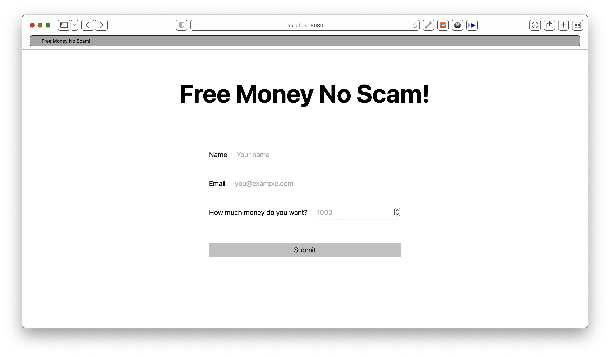
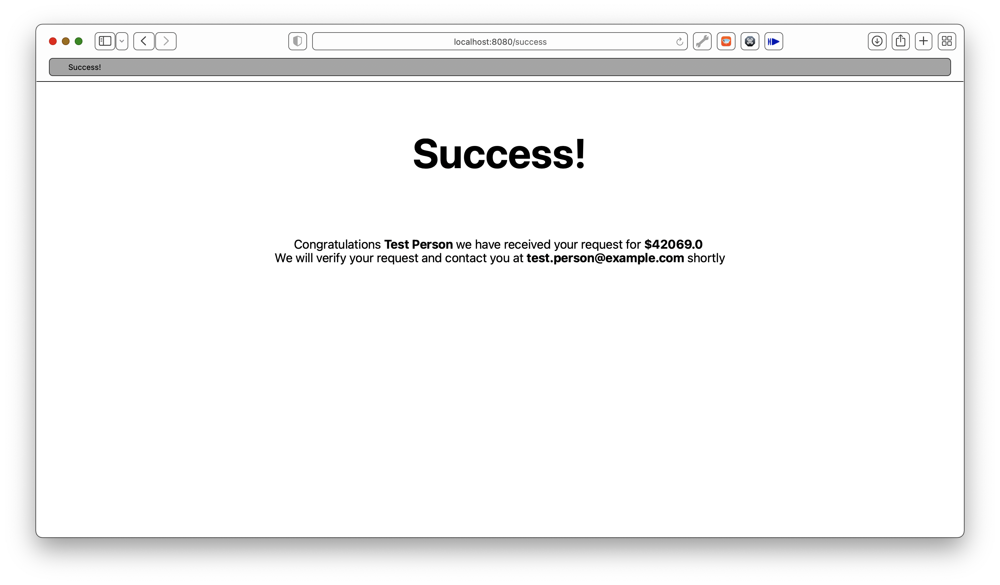
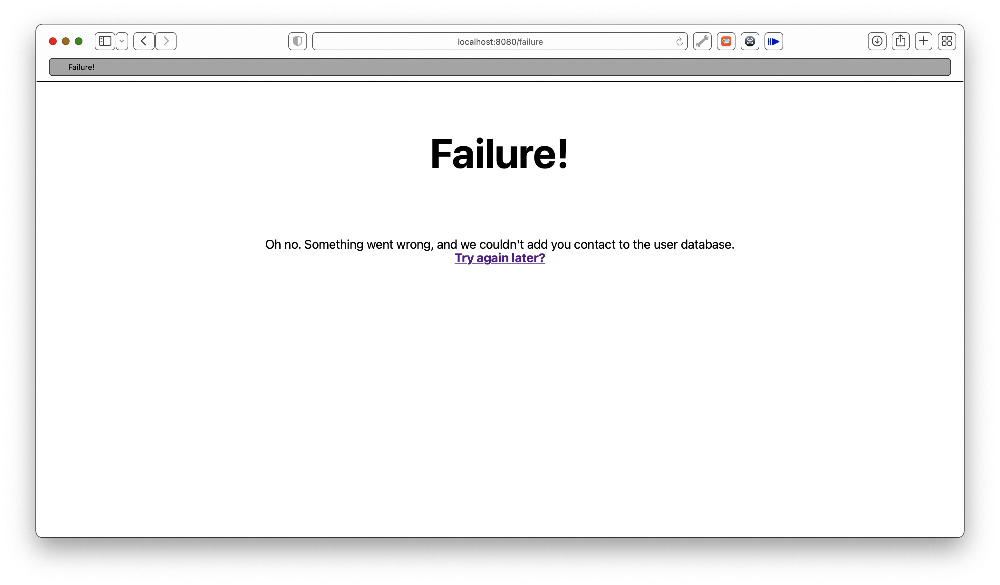

# Free Money No Scam
Living that full-stack scammer life, yo.

## Dependencies
A decent Java IDE with Maven support and a running SQL server should be enough.

## Build and Run
  1. Edit the [application.properties](src/main/resources/application.properties) file with the parameters for your database.
  2. Run

## Functionality
The `FreeMoneyController` class uses Spring's `@Autowired` to instantiate the `UserService` class.  
The `UserService` class also uses Spring's `@Autowired` to create a `JdbcTemplate` object.  
When using Spring's `Autowired` the `JdbcTemplate` object will read its configuration from the `application.properties` file.  

The `JdbcTemplate` class abstracts away the details of connecting to the database.
A connection pool will also be created and managed for you.

The `FreeMoneyController` class has a few endpoints:
  - #### GET `/`
    Serves up a small site with an HTML `<form>`. Each `input` elements has a `name` attribute,
    this allows the `<input type=submit>` to automatically create the request for you.  
    The `<input>` element leverages the `type="email"` attribute so the browser does a syntax validation
    before allowing the user to submit the form.
  - #### POST `/submit-form`
    This endpoint receives the data from the request. Then it makes a call to `UserService.create()`.  
    If the SQL query succeeds it redirects to `/success` if the query fails it redirects to `/failure`.
  - #### GET `/success`
    The `User` object is passed on from last endpoint handler with a `RedirectAttribute` and
    received by a `@ModelAttribute` on this endpoint.   
    The `User` object is then passed on to the template engine.
  - #### GET `/failure`
    A short error message is displayed.

## TODO
Currently, we are dropping the tables and recreating them every time the application restarts.
This is obviously not optimal if you want to save all those emails you have collected.  
Dumping the database to a file on shutdown and reloading the dump when restarting is left as an exercise for the reader ;)

## Screenshots

## Third-Party Software Used
  - [MySQL v8.0.26](https://github.com/mysql/mysql-server) | GPL 2.0
  - [OpenJDK 17](https://github.com/openjdk/jdk) | GPL 2.0
  - [Apache Maven](https://github.com/apache/maven) v3.8.2 | Apache 2.0 
  - [Spring Boot](https://github.com/spring-projects/spring-boot) v2.5.5 | Apache 2.0 
  - [normalize.css](https://github.com/necolas/normalize.css) v8.0.1 | MIT

## License
This project is released under the [WTFPL](http://www.wtfpl.net)